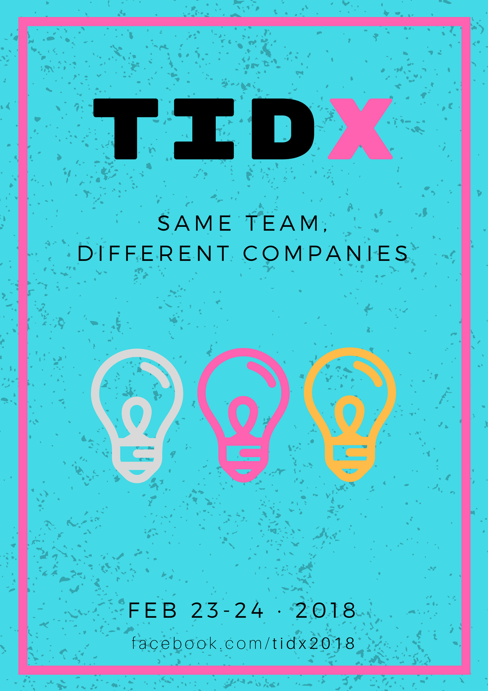

# Welcome to TID-X!

## Fechas
23-24 Febrero 2018

## Ubicación
Madrid. Estamos [buscando un sitio](issues/2) donde hospedar el evento. Si tienes alguna sugerencia,
por favor inclúyelo en el [issue asociado](issues/2).

## Asistentes

Visita la [lista de asistentes confirmados](asistentes.md).

Si quieres apuntarte, simplemente modifica el [fichero de
asistentes](https://github.com/tid-x/tid-x/edit/master/asistentes.md) para incluir tus datos.

## Social event viernes 23 de Febrero

Trabajaremos en este punto cuando tengamos definida la ubicación y el horario del sábado.

## Charlas sábado 24 de Febrero

Las charlas se elegirán de manera democrática, si bien las normas de la democracia
están por definir. Partamos de la base de que las charlas con mayor apoyo serán las
que formarán parte del evento.

### Quiero dar una charla, ¿cómo puedo proponerla?

No hay conferencia técnica sin charlas, por tanto necesitamos propuestas de charlas para
tener un sábado pleno de conocimientos! Puedes enviar tu propuesta de charla [abriendo
un issue en el repositorio](https://github.com/tid-x/tid-x/issues/new).

### Quiero mostrar mi apoyo/rechazo a una charla propuesta, ¿cómo puedo hacerlo?

Durante una revisión del technological plan de Telefónica I+D en 2016, utilizamos
[reactions](https://github.com/blog/2119-add-reactions-to-pull-requests-issues-and-comments)
para dar nuestro apoyo/rechazo a una propuesta de modificación del plan.

Creemos que fue una buena forma de participación, así que utilizaremos la misma
metodología. Revisa [las charlas propuestas](https://github.com/tid-x/tid-x/issues)
y vota a favor (👍) o en contra (👎) según tus preferencias.

Recordad que lo que se vota son las charlas, no las personas. Por favor que nadie
se sienta herido si ve 👎 en su propuesta.

## Recomendaciones de alojamiento

Trabajaremos en este punto cuando tengamos definida la ubicación.

## Merchandising

Es un punto importante, pero no urgente. Conforme nos acerquemos al evento le daremos
una vuelta.
